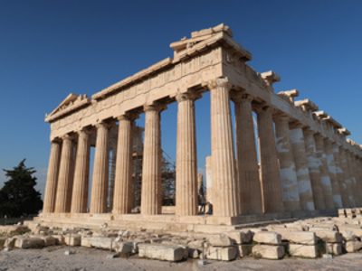

# Decsription
This is a TensorFlow implementation of the paper [A Neural Algorithm of Artistic Style](https://arxiv.org/abs/1508.06576). The Neural Style 
Transfer algorithm synthesizes new artistic images by combining the content of one image with the style of another image using a pre-trained 
Convolutional Neural Network (VGG-19) . Below you will find some of the generated images.

# Examples

 
 

Here, we are using the [Department of Informatics and Telecommunications](https://www.di.uoa.gr/en) as content image and various well known 
paintings as style images. Clearly, the algorithm produces visually appealing results:

Next, we will be using the [Parthenon](https://en.wikipedia.org/wiki/Parthenon) as the content image: 

