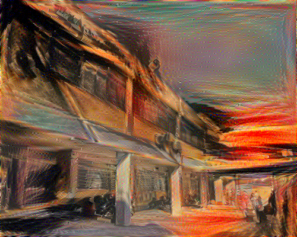

# Decsription
This is a TensorFlow implementation of the paper [A Neural Algorithm of Artistic Style](https://arxiv.org/abs/1508.06576). This Neural Style 
Transfer algorithm synthesizes new artistic images by combining the content of one image with the style of another image using a pre-trained 
Convolutional Neural Network (VGG-19) . Below you will find some of our generated images.

# Examples

 
 

Here, we are using the Department of Informatics and Telecommunications as content image and various well known paintings as style images. Clearly,the algorithm produces visually appealing results:

