# Decsription
This is a TensorFlow implementation of the paper [A Neural Algorithm of Artistic Style](https://arxiv.org/abs/1508.06576). The Neural Style 
Transfer algorithm synthesizes new artistic images by combining the content of one image with the style of another image using a pre-trained 
Convolutional Neural Network (VGG-19) . Below you will find some of the generated images.

# Examples
<p align="center">
 
 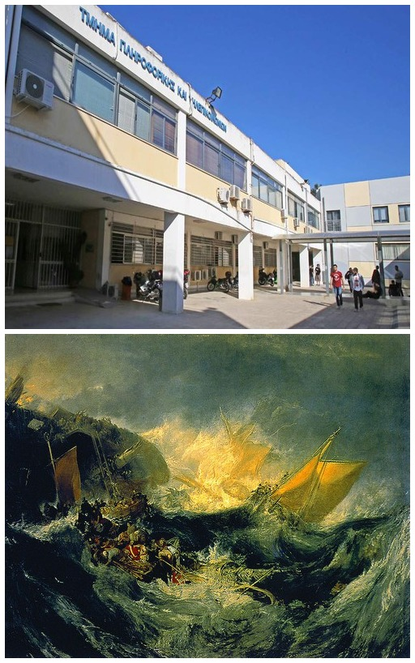
</p>

Here, we are using the [Department of Informatics and Telecommunications](https://www.di.uoa.gr/en) as content image and various well known 
paintings as style images. Clearly, the algorithm produces visually appealing results:

<p align="center">
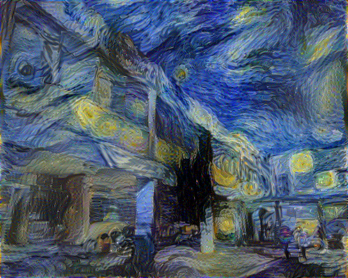
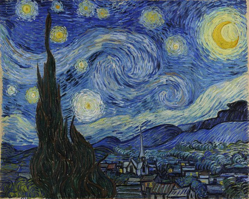
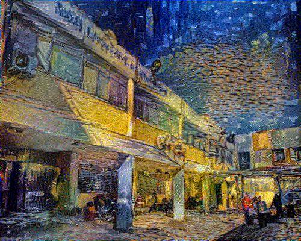
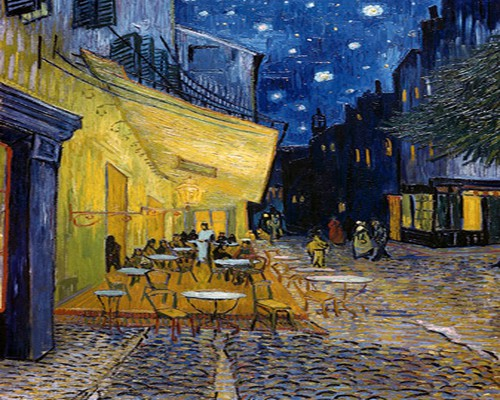
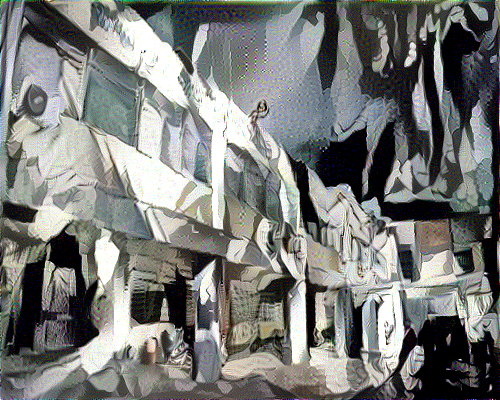
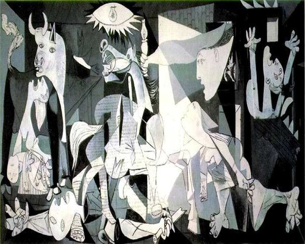
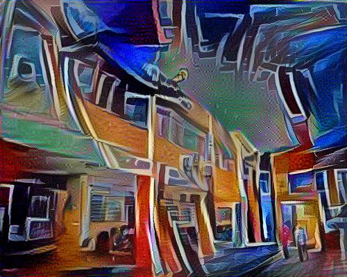
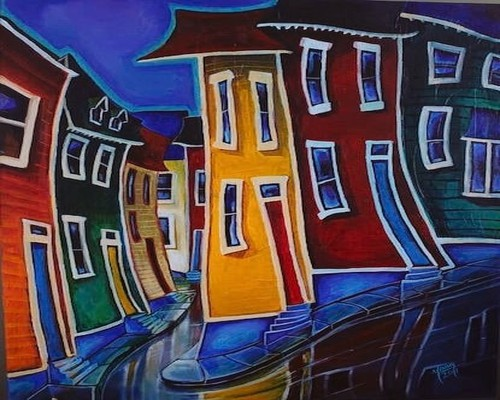
</p>

Next, we will be using the [Parthenon](https://en.wikipedia.org/wiki/Parthenon) as the content image: 

<p align="center">


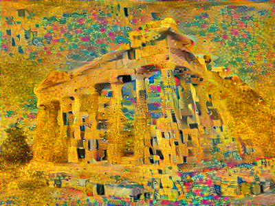
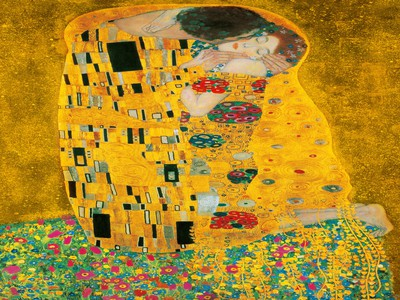
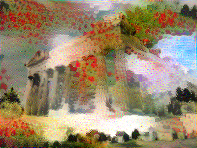

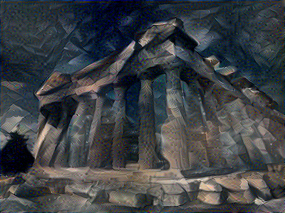
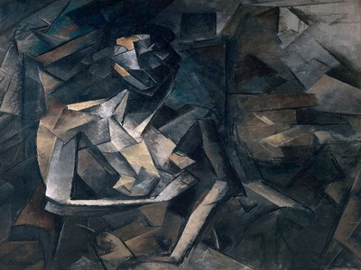
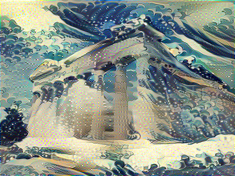
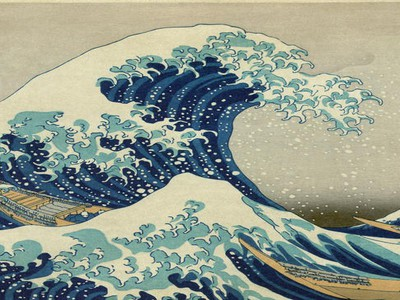
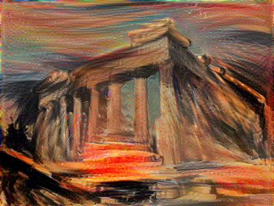
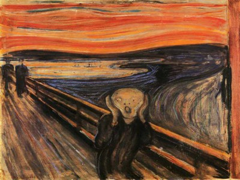
</p>

## Content / Style Tradeoff
One can adjust the trade-off between content and style by modifying the parameters a and b of the algorithm (see Implementation Details below).
From left to right the parameter b (emphasis on style) is increased, whereas parameter a (emphasis on content) is fixed. The style image used 
here is [Wassily Kardinsky's Composition VII](https://en.wikipedia.org/wiki/Composition_VII):

<p align="center">
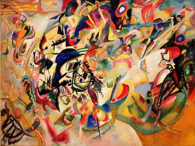
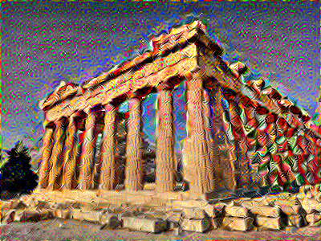
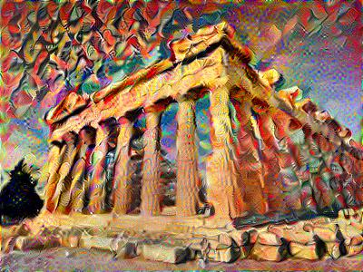
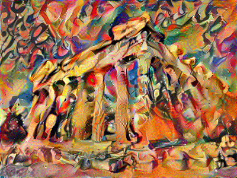
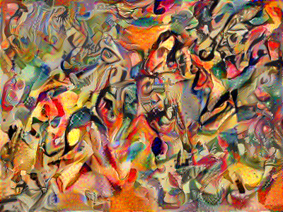
</p>

## Implementation Details
The Content and Style loss functions used are exactly the same as the ones the authors of the paper originally used. Furthermore, the style layers
used for the Style loss are also the same.  

The generated image is initialized to a percentage of white noise (fixed at 99%) before being fed to the ConvNet. The optimizer of choice in this 
implemetation is the [Adam Optimizer](https://arxiv.org/abs/1412.6980), insted of the [L-BFGS](https://en.wikipedia.org/wiki/Limited-memory_BFGS), 
which is what the authors used. As a result, the parameters of the algorithm required some tuning to obtain good results. In particular, we 
experimented with different values of `content weight`, `style weight` and `learning rate`. After some trial and error, we ended up on the 
following:
```
content weight (a) = 5
style weight (b)   = 50000/100000
learning rate      = 10
```
Running the algorithm for 1000-1500 iterations suffices and produces nice results. With certain images, the style weight might need to be adjusted.

* The VGG-19 CNN can be found [here](https://drive.google.com/drive/folders/1sP6HMKGu5nGb-szZ0qbHO4Q8kgRdjLt9).
