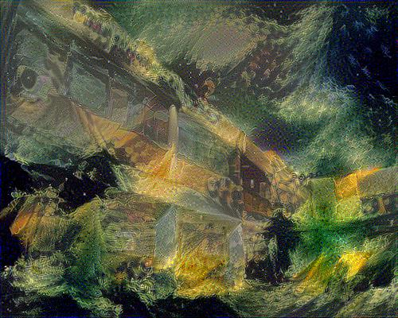

# Decsription
This is a TensorFlow implementation of the paper [A Neural Algorithm of Artistic Style](https://arxiv.org/abs/1508.06576). The Neural Style 
Transfer algorithm synthesizes new artistic images by combining the content of one image with the style of another image using a pre-trained 
Convolutional Neural Network (VGG-19) . Below you will find some of the generated images.

# Examples
<p align="center">
 
 
</p>

Here, we are using the [Department of Informatics and Telecommunications](https://www.di.uoa.gr/en) as content image and various well known 
paintings as style images. Clearly, the algorithm produces visually appealing results:

<p align="center">


</p>

Next, we will be using the [Parthenon](https://en.wikipedia.org/wiki/Parthenon) as the content image: 

<p align="center">


</p>

## Content / Style Tradeoff
One can adjust the trade-off between content and style by modifying the parameters a and b of the algorithm (see Implementation Details below).
From left to right the parameter b (emphasis on style) is increased, whereas parameter a (emphasis on content) is fixed. The style image used 
here is [Wassily Kardinsky's Composition VII](https://en.wikipedia.org/wiki/Composition_VII):

<p align="center">


</p>

## Implementation Details

The generated image is initialized with a percentage of white noise (the percentage for the examples above was 99%) before being fed to the 
ConvNet. The optimizer of choice in this implemetation is the [Adam Optimizer](https://arxiv.org/abs/1412.6980), instead of 
[L-BFGS](https://en.wikipedia.org/wiki/Limited-memory_BFGS), which is what the authors of the paper used. As a result, the parameters of the 
algorithm required some tuning in order to obtain good results. In particular, we experimented with different values of `content weight`, 
`style weight` and `learning rate`. After some 'trial and error', we ended up with the following:
```
content weight (a) = 5
style weight   (b) = 50000/100000/500000 (depending on the style image being used)
learning rate      = 10
```
With certain images, the `style weight` might need to be adjusted (choose on of the values shown above).  

The layers used for the style reconstructions are, as advised in the paper, `conv1_1`, `conv2_1`, `conv3_1`, `conv4_1` and `conv5_1` (in general 
the weight for each "active" layer is 1 / number of active layers, in our case 1/5) . For the content reconstructions layer `conv4_2` was used, 
again, as advised in the paper.  

In general, running the algorithm for 1000-1500 iterations produces visually appealing results. It is highly advised to run the algorithm on a 
GPU, since it significantly speeds up the process. For a 400x300 image, 1000 iterations take about 60 minutes on a CPU!

* The pre-trained VGG-19 network can be found [here](https://www.vlfeat.org/matconvnet/pretrained/). After downloading, place it on 
`./pretrained-model/imagenet-vgg-verydeep-19.mat`.
